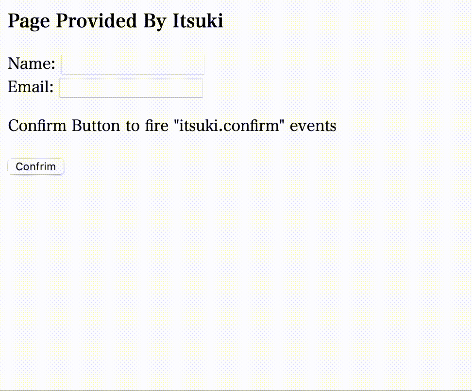

# Custom Plugin-provider/Javascript API Sekeleton for Web Application

## Overview
An example of a Javascript API that we use a lot will be `target.addEventListener(type, listener)` to add custom handlers to specific events.
<br>
This project is a skeleton for creating such APIs and allowing other developers to use those to add custom callbacks to specific events we dispatch with some custom data we provide.

For more details regarding to this project and code explanation, please refer to my blog: [Create Custom Plugin Provider (Javascript API) for Web App]().


## Specifics
The skeleton is written in Typescript and complied with Webpack.<br>
In this skeleton, we have two types of custom events with two kinds of custom data.

### Custom Data
1. Predefined static data on the window object
2. Dynamic data created when an event is fired

### Custom Events
1. Custom event fired on document load with custom data.
2. Custom event fired on button click. Specifically, we have some predefined onclick functions on the button. We will fire the custom event, execute the callbacks (if there is any) provided by other developers using the API interface. If `false` is returned from the callback, we will terminate the process, ie: not execute the original onclick handler; process on otherwise. This can be useful, for example, for other developers to provide additional validation check on the inputs.


## Set Up
## Requirement
- node.js
- npm

### Installation
`npm install`


### Build as development
`npx webpack --mode development` <br>
or <br>
`npm run dev`

### Build as production
`npx webpack --mode production` <br>
or <br>
`npm run build`

### Complied File
[dist/bundle.js](./dist/bundle.js): Complied js bundle that we can include in any web page to add our Javascript API and enable other developers to use to add custom callbacks to specific events.


## Demo
Usage of Javascript API by other(unknown) developers to add custom callbacks to events.
```Javascript
// script provided by other developers for customizing our page behavior with the Javascript API We provide
// event with custom data

(function () {
    // triggered on page show
    itsuki.events.on("itsuki.show", function (event) {
        console.log(event);
        // do something with custom event data
    });

    // triggered on confirm button click
    // event with custom data
    // return true to procced onto the button click event
    // return false to terminate
    itsuki.events.on("itsuki.confirm", function (event) {
        console.log(event);
        const name = event.data.name;
        if (name.length === 0) {
            alert('No empty name!');
            return false;
        }

        const isnum = /^\d+$/.test(name);
        if (isnum) {
            alert('You cannot have a name with only digit!');
            return false;
        }

        return true; //or false to terminate the default even
    });
})();
```


For complete demo, refer to [index.html](./dist/index.html)
